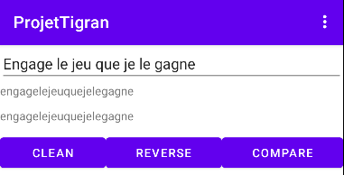
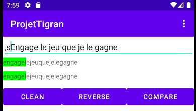
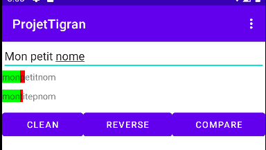
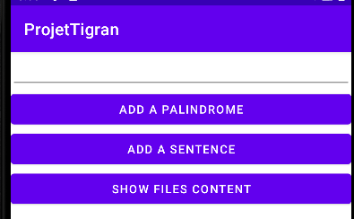
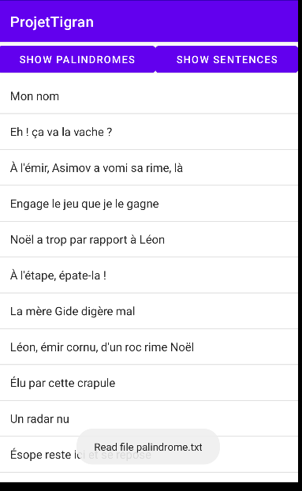

# Compte rendu du projet android Palindrome - Tigran SLAMA M2I2L

## Fonctionnalités

1. Vérifier un palindrome sur demande.
2. Vérifier une phrase aléatoire enregistrée.
3. Sauvegarder des phrases palindromes ou non.
4. Afficher le contenu des fichiers sauvegardés.

### I. La vérification de phrase

La vérification de phrase est construite autour de
l'activité [PalindromeActivity](https://github.com/Rolf1e/m2/blob/master/webmobile/ProjetTigran/app/src/main/java/com/example/projettigran/activities/PalindromeActivity.java)
.


Elle possède un champ de saisie de texte et trois boutons: `Clean`, `Reverse`, `Compare`.



Après avoir rempli correctement le champ, l'utilisateur peut appuyer sur
`Clean` qui permet de nettoyer la phrase de sa ponctuation, majuscules,
accents, etc afin de faciliter le travail.

#### *Dans le code*:

La classe délègue à la fonction `StringManipulation#cleaningUpString(String)`
le nettoyage de la chaîne. Elle remplace ou retire les lettres pouvqnt poser
problème.

Le bouton `Reverse` permet d'afficher le résultat de la phrase entrée dans le sens inverse.

#### *Dans le code*:

La classe délègue à la fonction `StringManipulation#reverse(String)` qui
retourne la phrase grâce à `StringBuilder`.

L'utilisateur peut ensuite appuyer sur `Compare` afin de vérifier si la phrase
entrée est un palindrome.

Dans le cas d'un palindrome, la chaîne deviendra complètement verte.



Sinon la comparaison s'arrête en changeant de couleur sur la lettre problèmatique.



#### *Dans le code*:

On vérifie d'abord que les deux chaînes soient de même taille afin d'éviter des
effets indésirables en accédant les éléments de Strings.

```java
public class PalindromeActivity extends AppCompatActivity {

    // ..

    private List<ComparisonResult> compare(final String normal,
                                           final String reversed) {

        final List<ComparisonResult> colorsToApply = new ArrayList<>(normal.length());
        for (int i = 0; i < normal.length(); i++) {
            final ComparisonResult compare = CharacterComparator.compare(normal.charAt(i), reversed.charAt(i));
            colorsToApply.add(compare);
            if (ComparisonResult.RED.equals(compare)) {
                break;
            }
        }
        return colorsToApply;
    }
}
```

Permet d'obtenir le résultat de comparaison des deux phrases.

Puis, afin de réaliser une animation fluide, le choix d'utiliser un task
scheduler à été pris. À l'aide de `PalindromeTimer` qui étend `CountDownTimer`
d'Android. Cette classe permet de préparer un scheduler du temps de la taille
du résultat `super(colorsToApply.size() * ONE_SECOND, ONE_SECOND);` qui
s'execute toutes les secondes.

```java
public class PalindromeTimer extends CountDownTimer {

    // ..

    @Override
    public void onTick(final long l) {
        final int until = Math.toIntExact((colorsToApply.size() * ONE_SECOND - l) / ONE_SECOND) + 1;

        final List<ComparisonResult> colorsToBeAppliedAtTime = IntStream.range(0, until)
                .boxed()
                .map(colorsToApply::get)
                .collect(Collectors.toList());

        final int size = colorsToBeAppliedAtTime.size();
        if (colorsToBeAppliedAtTime.contains(ComparisonResult.RED)) {
            displayColorsService.displayRed(palindromeView, Pair.create(size - 1, size));
            displayColorsService.displayRed(reversePalindromeView, Pair.create(size - 1, size));
            cancel();
        } else {
            displayColorsService.displayGreen(palindromeView, Pair.create(0, until));
            displayColorsService.displayGreen(reversePalindromeView, Pair.create(0, until));
        }

    }

    // ..
}
```

L'affichage de la couleur sur la chaîne est faite par
`DisplayColorsService#displayGreen(TextView, Pair<Integer, Integer>)` et
`DisplayColorsService#displayRed(TextView, Pair<Integer, Integer>)` . Ces
méthodes affiche respectivement du vert et du vert, rouge. (Il faut repeindre
toute la phrase depuis le début à chaque chagement). 

### II. Gestion des fichiers contenant des phrases

La classe `RegisterActivity` et `ShowFileSentenceActivity` jouent des roles
importants.



`ShowFileSentenceActivity` permet d'affichier via une `ListView` le contenu. Il
y a un composant `ResourceHandler` derriere qui permet de de lire dans le
dossier `res/raw`. Il effectue l'interaction entre les resources d'android et
le code. Cela permet de pouvoir avoir nos fichiers modifiables initialises avec nos donnees.




Afin de pouvoir persister les nouveaux palindromes de l'utilisateur,
`IOFileOperations` permet d'enregister dans l' `internal storage` du telephone.
On y effectue des operations de lecture et ecriture.

Le fait de pouvoir avoir des phrases aleatoires est gere dans `RandomPalindromeReader`.

```java
    public Optional<String> fetchRandomSentence(final Context context,
                                                final String... identifiers) {

        final List<String> sentences = Arrays.stream(identifiers)
                .map(identifier -> fetchContent(context, identifier))
                .flatMap(Collection::stream)
                .collect(Collectors.toList());

        return Optional.ofNullable(sentences.get(randomNumber(0, sentences.size())));
    }
```

Recupere les phrases dans resources et en choisit une aleatoire.


